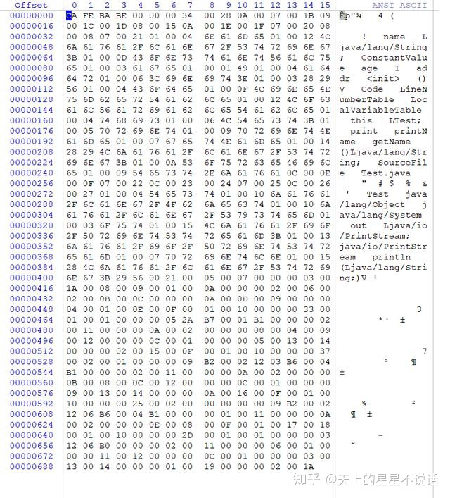

# class

ASM
cglib
javasssit

https://blog.csdn.net/kinglyjn/article/details/64439753

java class文件查看器
WinHex 
javap -v -p
-v 全局
-p 显示private方法


```
javap -v -p out/production/ClassReader/cn/wdidada/test/javaclass/Test.class
Classfile /D:/git/github/ClassReader/out/production/ClassReader/cn/wdidada/test/javaclass/Test.class
  Last modified 2020-11-19; size 755 bytes
  MD5 checksum 4016fdc93bb81fe210479375b612eae0
  Compiled from "Test.java"
public class cn.wdidada.test.javaclass.Test
  minor version: 0
  major version: 52
  flags: ACC_PUBLIC, ACC_SUPER
Constant pool:
   #1 = Methodref          #7.#27         // java/lang/Object."<init>":()V
   #2 = Fieldref           #28.#29        // java/lang/System.out:Ljava/io/PrintStream;
   #3 = String             #21            // print
   #4 = Methodref          #30.#31        // java/io/PrintStream.println:(Ljava/lang/String;)V
   #5 = Class              #32            // cn/wdidada/test/javaclass/Test
   #6 = String             #8             // name
   #7 = Class              #33            // java/lang/Object
   #8 = Utf8               name
   #9 = Utf8               Ljava/lang/String;
  #10 = Utf8               ConstantValue
  #11 = Utf8               age
  #12 = Utf8               I
  #13 = Utf8               addr
  #14 = Utf8               <init>
  #15 = Utf8               ()V
  #16 = Utf8               Code
  #17 = Utf8               LineNumberTable
  #18 = Utf8               LocalVariableTable
  #19 = Utf8               this
  #20 = Utf8               Lcn/wdidada/test/javaclass/Test;
  #21 = Utf8               print
  #22 = Utf8               printName
  #23 = Utf8               getName
  #24 = Utf8               ()Ljava/lang/String;
  #25 = Utf8               SourceFile
  #26 = Utf8               Test.java
  #27 = NameAndType        #14:#15        // "<init>":()V
  #28 = Class              #34            // java/lang/System
  #29 = NameAndType        #35:#36        // out:Ljava/io/PrintStream;
  #30 = Class              #37            // java/io/PrintStream
  #31 = NameAndType        #38:#39        // println:(Ljava/lang/String;)V
  #32 = Utf8               cn/wdidada/test/javaclass/Test
  #33 = Utf8               java/lang/Object
  #34 = Utf8               java/lang/System
  #35 = Utf8               out
  #36 = Utf8               Ljava/io/PrintStream;
  #37 = Utf8               java/io/PrintStream
  #38 = Utf8               println
  #39 = Utf8               (Ljava/lang/String;)V
{
  private static final java.lang.String name;
    descriptor: Ljava/lang/String;
    flags: ACC_PRIVATE, ACC_STATIC, ACC_FINAL
    ConstantValue: String name

  private int age;
    descriptor: I
    flags: ACC_PRIVATE

  private static java.lang.String addr;
    descriptor: Ljava/lang/String;
    flags: ACC_PRIVATE, ACC_STATIC

  public cn.wdidada.test.javaclass.Test();
    descriptor: ()V
    flags: ACC_PUBLIC
    Code:
      stack=1, locals=1, args_size=1
         0: aload_0
         1: invokespecial #1                  // Method java/lang/Object."<init>":()V
         4: return
      LineNumberTable:
        line 15: 0
        line 16: 4
      LocalVariableTable:
        Start  Length  Slot  Name   Signature
            0       5     0  this   Lcn/wdidada/test/javaclass/Test;

  private void print();
    descriptor: ()V
    flags: ACC_PRIVATE
    Code:
      stack=2, locals=1, args_size=1
         0: getstatic     #2                  // Field java/lang/System.out:Ljava/io/PrintStream;
         3: ldc           #3                  // String print
         5: invokevirtual #4                  // Method java/io/PrintStream.println:(Ljava/lang/String;)V
         8: return
      LineNumberTable:
        line 18: 0
        line 19: 8
      LocalVariableTable:
        Start  Length  Slot  Name   Signature
            0       9     0  this   Lcn/wdidada/test/javaclass/Test;

  private static void printName();
    descriptor: ()V
    flags: ACC_PRIVATE, ACC_STATIC
    Code:
      stack=2, locals=0, args_size=0
         0: getstatic     #2                  // Field java/lang/System.out:Ljava/io/PrintStream;
         3: ldc           #6                  // String name
         5: invokevirtual #4                  // Method java/io/PrintStream.println:(Ljava/lang/String;)V
         8: return
      LineNumberTable:
        line 21: 0
        line 22: 8

  public java.lang.String getName();
    descriptor: ()Ljava/lang/String;
    flags: ACC_PUBLIC
    Code:
      stack=1, locals=1, args_size=1
         0: ldc           #6                  // String name
         2: areturn
      LineNumberTable:
        line 24: 0
      LocalVariableTable:
        Start  Length  Slot  Name   Signature
            0       3     0  this   Lcn/wdidada/test/javaclass/Test;
}
SourceFile: "Test.java"
```


```shell script

ConstantPool:40
#5 class        cn/wdidada/test/javaclass/Test
#7 class        java/lang/Object
#8 UTF-8        name
#9 UTF-8        Ljava/lang/String;
#10 UTF-8        ConstantValue
#11 UTF-8        age
#12 UTF-8        I
#13 UTF-8        addr
#14 UTF-8        <init>
#15 UTF-8        ()V
#16 UTF-8        Code
#17 UTF-8        LineNumberTable
#18 UTF-8        LocalVariableTable
#19 UTF-8        this
#20 UTF-8        Lcn/wdidada/test/javaclass/Test;
#21 UTF-8        print
#22 UTF-8        printName
#23 UTF-8        getName
#24 UTF-8        ()Ljava/lang/String;
#25 UTF-8        SourceFile
#26 UTF-8        Test.java
#27 NameAndType        <init>
#28 class        java/lang/System
#29 NameAndType        out
#30 class        java/io/PrintStream
#31 NameAndType        println
#32 UTF-8        cn/wdidada/test/javaclass/Test
#33 UTF-8        java/lang/Object
#34 UTF-8        java/lang/System
#35 UTF-8        out
#36 UTF-8        Ljava/io/PrintStream;
#37 UTF-8        java/io/PrintStream
#38 UTF-8        println
#39 UTF-8        (Ljava/lang/String;)V


classname:cn/wdidada/test/javaclass/Test
superclass:java/lang/Object

field:name, desc:Ljava/lang/String;
field:age, desc:I
field:addr, desc:Ljava/lang/String;

method:<init>(), desc:()V
aload_0
invokespecial
nop
aconst_null
return

method:print(), desc:()V
getstatic
nop
iconst_m1
ldc
iconst_0
invokevirtual
nop
iconst_1
return

method:printName(), desc:()V
getstatic
nop
iconst_m1
ldc
iconst_3
invokevirtual
nop
iconst_1
return

method:getName(), desc:()Ljava/lang/String;
ldc
iconst_3
areturn


Process finished with exit code 0


```
